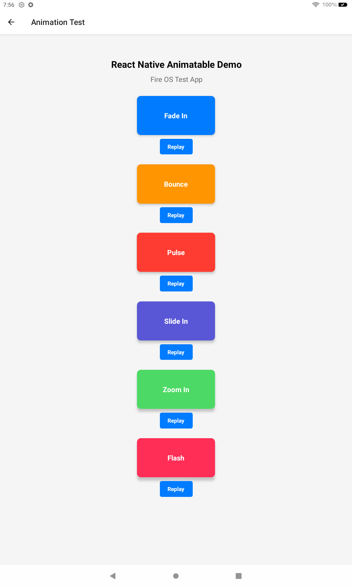

# React Native Animatable Demo

A React Native application showcasing various animations using the `react-native-animatable` library. This app demonstrates different animation types and effects, specifically tested on Amazon Fire OS devices.

## Features

- Multiple animation demonstrations:
  - Fade In
  - Bounce
  - Pulse (infinite)
  - Slide In
  - Zoom In
  - Flash
- Interactive replay buttons for each animation
- Optimized for Fire OS tablets
- Built with Expo and React Native

## Screenshot



## Technology Stack

- React Native
- Expo
- react-native-animatable
- Expo Router for navigation

## Installation

1. Clone this repository
2. Install dependencies:
   ```bash
   npm install
   ```
3. Start the development server:
   ```bash
   npx expo start
   ```

## Usage

The app provides a simple interface to test various animations:

1. Open the app
2. Tap on "Open Animation Test"
3. View the different animations
4. Use the "Replay" buttons to trigger animations again

## Why react-native-animatable?

React Native Animatable is a declarative animation library that makes it easy to create and manage animations in React Native applications. It's particularly useful for:

- Creating engaging user interfaces
- Adding visual feedback to user interactions
- Implementing attention-grabbing elements
- Building smooth transitions between UI states

## Testing on Fire OS

This app has been specifically tested on Amazon Fire tablets to ensure compatibility with Fire OS.

## License

MIT
